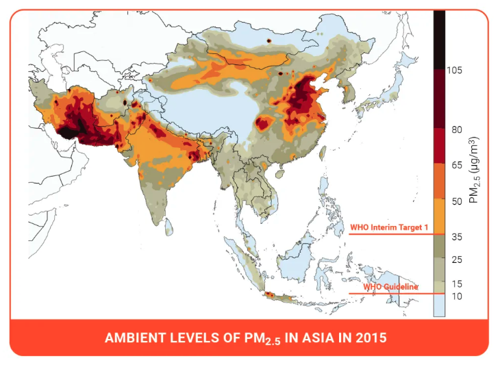

```{r setup, include=FALSE}
knitr::opts_chunk$set(echo = TRUE)
# Load all the packages needed here
library(tidyverse)
library(readr)
library(gt)
library(tufte)

# Set your file path here! Or, set this up as an .Rproj if you'd like.
rootdir <- "/Users/gabriellebenoit/Documents/GitHub/EDS_222"

source(file.path(rootdir,"labs","_common.R"))


``` 

_(The case study in this exercise is based on reality, but does not include actual observational data.)_


# Air Pollution in Lahore, Pakistan 

```{r, out.width = "100%", echo=FALSE, fig.margin=TRUE}

```

In this exercise we will look at a case study concerning air quality in South Asia. The World Health Organization estimates that air pollution kills an estimated seven million people per year, due to its effects on the cardiovascular and respiratory systems. Out of the 40 most polluted cities in the world, South Asia is home to 37, and Pakistan was ranked to contain the second most air pollution in the world in 2020 (IQAIR, 2020). In 2019, Lahore, Pakistan was the 12th most polluted city in the world, exposing a population of 11.1 million people to increased mortality and morbidity risks. 

In this exercise, you are given two datasets^[All data for EDS 222 will be stored on the Taylor server, in the shared `/courses/EDS222/data/` directory. Please see material from EDS 214 on how to access and retrieve data from Taylor. These data are small; all compute can be handled locally. Thanks to Bren PhD student Fatiq Nadeem for assembling these data!] from Lahore, Pakistan and are asked to compare the two different data collection strategies from this city. These data are:

- Crowd-sourced data from air quality monitors located in people's homes. These data are voluntarily collected by individual households who choose to install a monitor in their home and upload their data for public access. 

- Official government data from monitors installed by government officials at selected locations across Lahore. There have been reports that government officials strategically locate monitors in locations with cleaner air in order to mitigate domestic and international pressure to clean up the air. 

In answering the following questions, please consider the lecture content from class on sampling strategies, as well as the material in Chapter 2 of [_Introduction to Modern Statistics_](https://openintro-ims.netlify.app/). Include in your submission an `.Rmd` file and a compiled `.html` file, each containing complete answers to all questions (as well as all your code in the `.Rmd`). 

## Question 1: 

Load the data from each source and label it as `crowdsourced` and `govt` accordingly. For example: 

```{r}
crowdsourced <- readRDS("/Users/gabriellebenoit/Documents/GitHub/EDS_222/HW1/data/airpol-PK-crowdsourced.RDS")
govt <- readRDS("/Users/gabriellebenoit/Documents/GitHub/EDS_222/HW1/data/airpol-PK-govt.RDS")
```
1. These dataframes have one row per pollution observation. How many pollution records are in each dataset? 

In the crowdsourced dataset, there are 5,488 pollution records. In the govt dataset, there are 1,960 pollution records.
```{r}
dim(crowdsourced)

dim(govt)

```

2. Each monitor is located at a unique latitude and longitude location. How many unique monitors are in each dataset?^[**Hint:** `group_by(longitude,latitude)` and `cur_group_id()` in `dplyr` will help in creating a unique identifier for each (longitude, latitude) pair.]

cur_group_id() gives a unique numeric identifier for the current group.

Crowdsourced data: 14 unique locations
Government data: 5 unique locations


```{r}
crowd_unique <- crowdsourced %>% group_by(longitude,latitude) %>% mutate(id = cur_group_id())

govt_unique <- govt %>% group_by(longitude, latitude) %>% mutate(id = cur_group_id())


options(pillar.sigfig=4) # I don't think this is doing anything... 
unique_obs_crowd <- crowdsourced %>%
  group_by(longitude, latitude) %>%
  summarize(count = n())
# I think this is telling me there are 14 unique locations (latitude and longitudes) with 392 observations in each
# 392*14 = 5488, which is the # of observations in the data set

options(pillar.sigfig=4)
unique_obs_govt <- govt %>%
  group_by(longitude, latitude) %>%
  summarize(count = n())
# I think this is telling me there are 5 unique locations (latitude and longitudes) with 392 observations in each
# 392*5 = 1960, which is the # of observations in the data set

```

## Question 2:

The goal of pollution monitoring in Lahore is to measure the average pollution conditions across the city.

1. What is the _population_ in this setting? Please be precise. 
The population is all individuals living in Lahore, which according to the introduction to this assignment, is roughly 11.1 million people.

2. What are the _samples_ in this setting? Please be precise.
The sample is only 7448 (5,488 + 1,960) homes, which may contain more than one individual. According to the intro to this assignment, the crowdsourced data is gathering air quality data from people who chose to install the monitor (5,488 homes), and chose to upload their data for public access. The government data is located in 1,960 homes, and it is likely biased toward cleaner air locations in order to reduce the pressure from both domestic and international groups urging Lahore, Pakistan officials to take steps to improve the air quality.


3. These samples were not randomly collected from across locations in Lahore. Given the sampling approaches described above, discuss possible biases that may enter when we use these samples to construct estimates of population parameters.   

The crowdsourced data is likely biased toward homes where the individuals are knowledgeable about the harms of air pollution, and therefore motivated to contribute to citizen science efforts that will demonstrate, with data, the lived experience of air pollution. The individuals are likely well educated, housed in permanent structures, and civicly engaged.

The govertment data is likely biased toward clean air; the locations of the air monitored are likely (1) in wealthy homes/buildings that have advanced infrastructure or are simply located in less congested parts of Lahore (2) located in areas that geographically lend themselves to less air pollution, so not valleys by mountain ranges, for example. 

## Question 3: 

1. For both the government data and the crowd-sourced data, report the sample mean, sample minimum, and sample maximum value of PM 2.5 (measured in $\mu g/m^3$). 

```{r, include = TRUE, fig.margin = TRUE}
mean(crowdsourced$PM) # equals 70.2008
mean(govt$PM) # equals 39.64694

min(crowdsourced$PM) # equals 20
min(govt$PM) # equals 15

max(crowdsourced$PM) # equals 120
max(govt$PM) # equals 65

```

```{r, include = TRUE, fig.margin = TRUE}
hist(crowdsourced$PM)
boxplot(crowdsourced$PM)

ggplot(crowdsourced, aes(y=PM)) + 
  geom_boxplot() +
  theme_minimal()

hist(govt$PM)
boxplot(govt$PM)

ggplot(govt, aes(y=PM)) + 
  geom_boxplot() +
  theme_minimal()

```

2. Discuss any key differences that you see between these two samples. 
The mean, min, and max of PM 2.5 in the government samples are consistently almost half the value of that in the crowdsourced data. This demonstrates that the government sample that assesses the population measure of air pollution is NOT describing the full range of air pollution experiences in Lahore. 

3. Are the differences in mean pollution as expected, given what we know about the sampling strategies?

Yes, these differences are expected, but the extent of it was a surprise!

## Question 4: 

Use the location of the air pollution stations for both of the sampling strategies to generate a map showing locations of each observation. Color the two samples with different colors to highlight how each sample obtains measurements from different parts of the city.^[**Hint:** `longitude` indicates location in the _x_-direction, while `latitude` indicates location in the _y_-direction. With `ggplot2` this should be nothing fancy. We'll do more spatial data in `R` later in the course.] 


```{r, include = TRUE, out.width = "100%", echo = FALSE, fig.margin = TRUE}

# used this code: https://stackoverflow.com/questions/17723822/administrative-regions-map-of-a-country-with-ggmap-and-ggplot2
# this isn't quite right, and I can't figure out how to fix it

data(world.cities)
Pakistan <- data.frame(map("world", "Pakistan", plot=FALSE)[c("x","y")])

p <- ggplot(Pakistan, aes(x=x, y=y)) +
     geom_path(colour = 'brown', linestyle = 2) +
     coord_map() + theme_bw()
p <- p + labs(x=" ", y=" ")
p <- p + theme(panel.grid.minor=element_blank(), panel.grid.major=element_blank())
p <- p + theme(axis.ticks = element_blank(), axis.text.x = element_blank(), axis.text.y = element_blank())
p <- p + theme(panel.border = element_blank())
print(p)


# another source: https://map-rfun.library.duke.edu/01_georeference

library(tidyverse)
library(sf)
#install.packages("mapview")
library(mapview)

# great map!
## crowdsources data
mapview(crowdsourced, xcol = "longitude", ycol = "latitude", crs = 4269, grid = FALSE)

# alternative map
pakistan_pollution_crowd <- st_as_sf(crowdsourced, coords = c("longitude", "latitude"),  crs = 4326)
mapview(pakistan_pollution_crowd, map.types = "Stamen.Toner") 

## government data
mapview(govt, xcol = "longitude", ycol = "latitude", crs = 4269, grid = FALSE)

# alternative map
pakistan_pollution_govt <- st_as_sf(govt, coords = c("longitude", "latitude"),  crs = 4326)
mapview(pakistan_pollution_govt, map.types = "Stamen.Toner") 

# does this work?
A_crowd <- mapview(crowdsourced, xcol = "longitude", ycol = "latitude", crs = 4269, grid = FALSE)
B_govt <- mapview(govt, xcol = "longitude", ycol = "latitude", crs = 4269, grid = FALSE)

A_crowd + B_govt

```

## Question 5: 

The local newspaper in Pakistan, _Dawn_, claims that the government is misreporting the air pollution levels in Lahore. Do the locations of monitors in question 4, relative to crowd-sourced monitors, suggest anything about a possible political bias? 

Yes, it appears the government is misreporting the air pollution levels in Lahore. As we can see in the previous question, the crowdsourced data monitores are pretty spread out, whereas the government monitors are much fewer in number, and clustered in the northeast part of Lahore.

## Question 6:

Given the recent corruption in air quality reporting, the Prime Minister of Pakistan has hired an independent body of  environmental data scientists to create an unbiased estimate of the mean PM 2.5 across Lahore using some combination of both government stations and crowd sourced observations. 

NASA's satellite data indicates that the average PM across Lahore is 89.2 $\mu g/m^3$. Since this is the most objective estimate of population-level PM 2.5 available, your goal is to match this mean as closely as possible by creating a new ground-level monitoring sample that draws on both the government and crowd-sourced samples. 

### Question 6.1: 

First, generate a _random sample_ of size $n=1000$ air pollution records by (i) pooling observations across the government and the crowd-sourced data;^[**Hint:** `bind_rows()` may be helpful.] and (ii) drawing observations at random from this pooled sample. 

```{r, include = TRUE, eval = TRUE}

# using law of large numbers notes from lab class 

set.seed(1234)
sims <- 1000

sample_means = list()
for (n in 1:sims) {
  x = rnorm(n, mean=89.2, sd=1)
  sample_means[[n]] = sum(x)/n
}


n = seq(1,sims,1)
lln_df = as.data.frame(cbind(n,sample_means))
lln_df[,] = lapply(lln_df[,], as.numeric)

ggplot(data = lln_df) +
  geom_line(aes(x = n, y = sample_means)) +
  geom_hline(yintercept = 89.2) +
  labs(x = "Sample Size", y = "Sample Mean") +
  theme_bw()


# using this source: https://www.statology.org/dplyr-bind_rows-bind_cols/#:~:text=You%20can%20use%20the%20bind_rows,%2C%20df3%2C%20...) AND https://statology.org/random-sample-in-r/
# pooled <- bind_rows(crowdsourced, govt)

# random_sample <- sample(pooled, size = 1000, replace = TRUE)

# I feel like binding the rows together wasn't the right choice. Here is another approach:

merged <- merge(crowdsourced, govt, by = c("date", "PM", "latitude", "longitude"), all = TRUE)

random_sample_2 <- sample(merged, size = 1000, replace = TRUE)

```

Second, create a _stratified random sample_. Do so by (i) stratifying your pooled data-set into strata of 0.01 degrees of latitude, and (ii) randomly sampling 200 air pollution observations from each stratum. 

```{r, include = TRUE, eval = TRUE}

#random_sample <- random_sample[order(random_sample$latitude), ]

#min_lat <- min(random_sample$latitude)
#max_lat <- max(random_sample$latitude)
#stratum_width <- 0.01

#random_sample$latitude_stratum <- cut(random_sample$latitude, 
                                   #  breaks = seq(min_lat, max_lat, by = stratum_width),
                                   #  labels = FALSE,
                                   #  include.lowest = TRUE)
# The 'latitude_stratum' column now contains the information about which stratum each observation belongs to

### NOT WORKING (next 9 lines - run the lines after "checking" first)
# Set the seed for reproducibility
#set.seed(123)

# Group by latitude_stratum and sample 200 observations from each stratum
#sampled_data <- random_sample %>%
 # group_by(latitude_stratum) %>%
 # slice_sample(n = 200, replace = FALSE)

# 'sampled_data' now contains 200 randomly sampled observations from each stratum


### checking 
#unique(pooled$latitude)

# Identify which columns in your dataset have duplicate names. You can use the duplicated function to check for duplicated column names
#duplicated_cols <- random_sample %>%
#  names() %>%
#  duplicated()

#print(names(random_sample)[duplicated_cols])

# Alternatively, you can use the make.names function to generate unique names:
#names(random_sample) <- make.names(names(random_sample), unique = TRUE)


# I feel like binding the rows together wasn't the right choice. Here is another approach:

merged <- merge(crowdsourced, govt, by = c("date", "PM", "latitude", "longitude"), all = TRUE)

random_sample_2 <- sample(merged, size = 1000, replace = TRUE)

random_sample_2 <- random_sample_2[order(random_sample_2$latitude), ]

min_lat <- min(random_sample_2$latitude)
max_lat <- max(random_sample_2$latitude)
stratum_width <- 0.01

random_sample_2$latitude_stratum <- cut_interval(random_sample_2$latitude, length = stratum_width)
# The 'latitude_stratum' column now contains the information about which stratum each observation belongs to

# Set the seed for reproducibility
set.seed(123)

# Group by latitude_stratum and sample 200 observations from each stratum
sampled_data <- random_sample_2 %>%
  group_by(latitude_stratum) %>%
  slice_sample(n = 200, replace = FALSE)

# 'sampled_data' now contains 200 randomly sampled observations from each stratum

options(pillar.sigfig=4)
unique(random_sample_2$latitude_stratum)
# [1] [31.55,31.56] (31.56,31.57] (31.57,31.58] (31.58,31.59] (31.59,31.6]  (31.6,31.61] 
# Levels: [31.55,31.56] (31.56,31.57] (31.57,31.58] (31.58,31.59] (31.59,31.6] (31.6,31.61]


```

### Question 6.2:

Compare estimated means of PM 2.5 for each sampling strategy to the NASA estimate of 89.2 $\mu g/m^3$. Which sample seems to match the satellite data best? What would you recommend the Prime Minister do? Does your proposed sampling strategy rely more on government or on crowd-sourced data? Why might that be the case?  

The proposed stratified sampling is much closer to the NASA estimate than the only random sampling technique, the crowdsourced data, and the govt data. Therefore, the stratification must rely more heavily on the crowdsourced data. This might be the case because (1) there were many more individual observations in the crowdsourced data (2) there was more variety in the location of the crowdsourced data, and therefore they were represented in more strata. I would recommend that the Prime Minister utilize the stratified sampling strategy, and that they require third party data analysis for environmental topics, such as air pollution, in order to reduce mis-represented data that paints a more favorable, yet inaccurate picture of reality. 

A stratified sample draws observations based on categories (in this case, bins of 0.01 degrees latitude), which ensures that the diversity/heterogeneity of the population is captured when the sampling occurs. in this case, after forming the bins (stratifying the population by 0.01 degrees latitude), then random samples are independently selected from each stratum. 
A random sample simply selects observations from the population by chance (every observation has the same likelihood of being selected), and does not take into account any specific characteristics of interest. 
In our situation, we wanted to accurately represented as many locations in Lahore, Pakistan that have air pollution monitors, and so stratifying by latitude ensures that we select observations from a variety of latitudes within the city, within our dataset, and avoid getting samples that happen (by chance) to be all near each other (... or away from pollution hubs).

Mean of Random Sample = 62.2

Mean of Stratified Sample = 66.4

Mean of Crowdsourced Data = 70.2

Mean of Government Data = 39.6

```{r, include = TRUE, eval = TRUE}

mean(random_sample_2$PM) # 62.2

mean(sampled_data$PM) # 66.4

### as compared to earlier in this assignment, this data:
mean(crowdsourced$PM) # equals 70.2008
mean(govt$PM) # equals 39.64694

min(crowdsourced$PM) # equals 20
min(govt$PM) # equals 15

max(crowdsourced$PM) # equals 120
max(govt$PM) # equals 65

```
